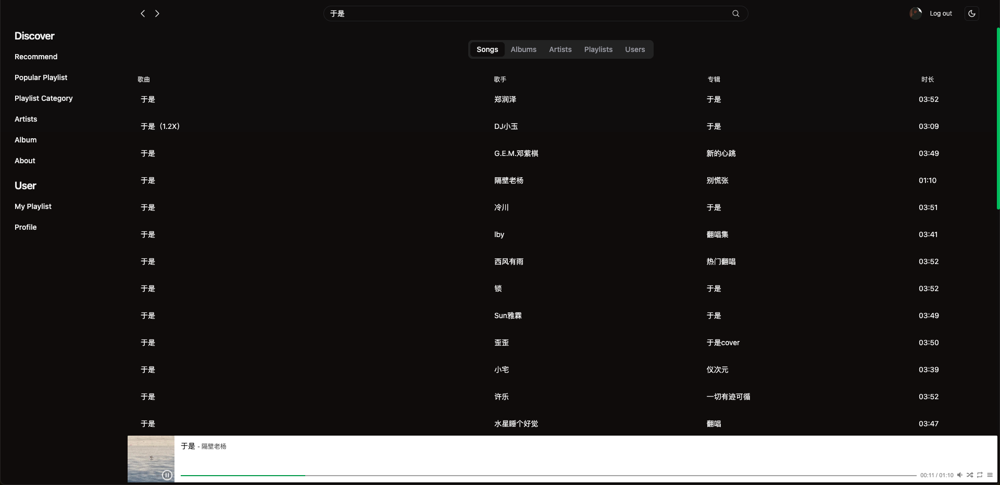
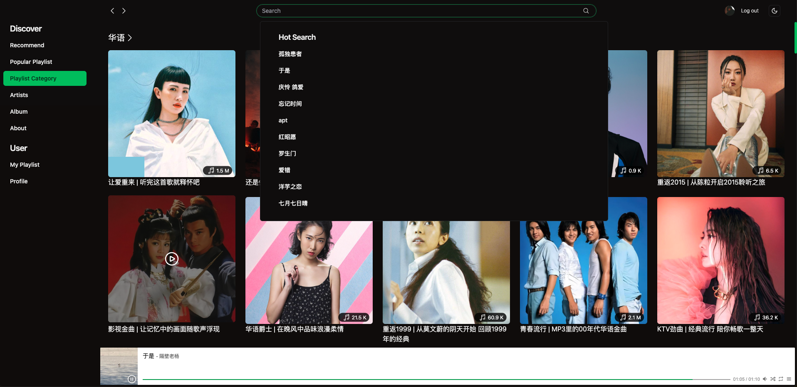
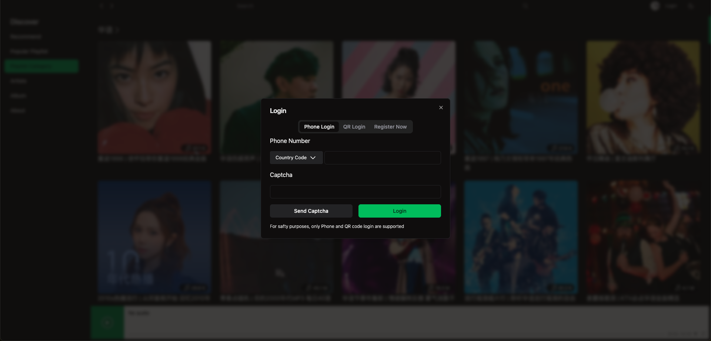
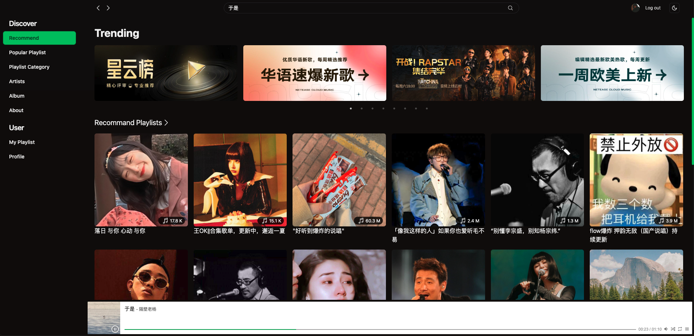

# React-Music-App
Web-based spotify theme music application, implemented with Netease Music APIs
Backend APIs: [Netease Cloud Music API](https://gitlab.com/Binaryify/neteasecloudmusicapi)

## Demo
[https://react-music-rose.vercel.app/home](https://react-music-rose.vercel.app/home)

## Tech Stack
react + vite + react-router + zustand + tailwindcss + radix-ui + axios + react-query

## Features
- Login/ Register with Netease Music account(QR, Phone)
    - For safty purpose, only QR/Phone login is implemented
- Play music (APlayer is configured, but most of the music are not avavilable due to copyright)
- Search music, artist, playlist, album(hot search, suggest search)
- Personalized recommendation(New Song, New Playlist, Toplist)
- View artist, playlist, album details
- Song, Album, Playlist, Artist based on category
- Dark and light theme
- View user profile

## Screenshots

